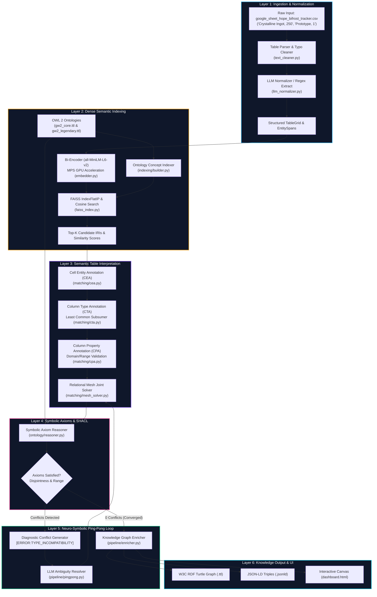
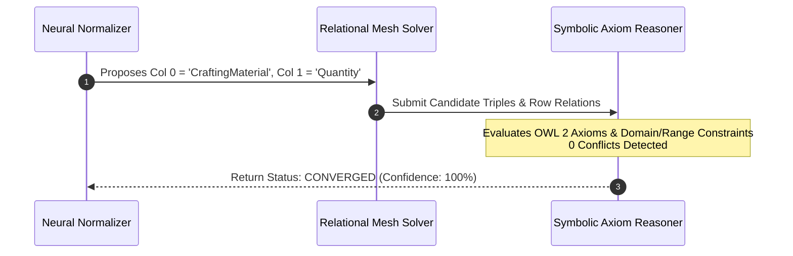

# GW2-UME: End-to-End System Architecture & Execution Flow

This document details the complete end-to-end architecture of the **GW2 Universal Matching Engine (`gw2-ume`)**, traced step-by-step using a real-world example from our CSV datasets: [`data/sample_tables/google_sheet_hope_bifrost_tracker.csv`](https://github.com/cdcc-jpg/gw2-ume/blob/main/data/sample_tables/google_sheet_hope_bifrost_tracker.csv).

For the formal research thesis on the **Minimum Viable Semantic Layer (MVSL)** and why this architecture supersedes traditional Named Entity Recognition (NER), see [Minimum Viable Semantic Layer & Post-NER Paradigm](file:///Users/clementd/Documents/GitHub/gw2-ume/docs/minimum_viable_semantic_layer.md).

---

## 1. High-Level Architecture Overview



---

## 2. Step-by-Step Tracing of a Real CSV Row

We trace the real-world messy CSV cell:
$$\text{Cell Data: } \texttt{"Crystalline Ingot, 250"}$$
taken from [`data/sample_tables/google_sheet_hope_bifrost_tracker.csv`](https://github.com/cdcc-jpg/gw2-ume/blob/main/data/sample_tables/google_sheet_hope_bifrost_tracker.csv#L10) under the recipe column for **HOPE**.

---

### Step 1: Ingestion & Text Normalization
* **Files**: [`src/gw2_ume/normalization/text_cleaner.py`](https://github.com/cdcc-jpg/gw2-ume/blob/main/src/gw2_ume/normalization/text_cleaner.py) & [`src/gw2_ume/normalization/llm_normalizer.py`](https://github.com/cdcc-jpg/gw2-ume/blob/main/src/gw2_ume/normalization/llm_normalizer.py)
* **Action**:
  1. Identifies delimiter pattern `", 250"` and splits the token into `label="Crystalline Ingot"` and `quantity=250`.
  2. Resolves any typographical variants or player abbreviations.
  3. Constructs a clean `EntitySpan` object:
     ```python
     EntitySpan(
         text="Crystalline Ingot",
         normalized_text="Crystalline Ingot",
         candidate_types=["CraftingMaterial"],
         quantity=250,
         start_char=0,
         end_char=16
     )
     ```

---

### Step 2: Dense Bi-Encoder Embedding & Vector Search
* **Files**: [`src/gw2_ume/indexing/embedder.py`](https://github.com/cdcc-jpg/gw2-ume/blob/main/src/gw2_ume/indexing/embedder.py) & [`src/gw2_ume/indexing/faiss_index.py`](https://github.com/cdcc-jpg/gw2-ume/blob/main/src/gw2_ume/indexing/faiss_index.py)
* **Action**:
  1. Computes the 384-dimensional dense embedding vector on Apple Silicon GPU (`mps`):
     $$\mathbf{u} = \frac{\text{Encoder}(\text{"Crystalline Ingot"})}{\|\text{Encoder}(\text{"Crystalline Ingot"})\|_2} \in \mathbb{R}^{384}$$
  2. Performs maximum inner-product search (MIPS) against the FAISS index built from `gw2_core.ttl` and `gw2_legendary.ttl`:
     $$\text{sim}(\mathbf{u}, \mathbf{v}_{\text{IRI}}) = \langle \mathbf{u}, \mathbf{v}_{\text{IRI}} \rangle$$
  3. **Top Retrieved Matches**:
     * `gw2:CrystallineIngot` (`CraftingMaterial`): **Cosine Similarity = 0.978**
     * `gw2:CrystallineOre` (`CraftingMaterial`): **Cosine Similarity = 0.812**
     * `gw2:CrystallineDust` (`CraftingMaterial`): **Cosine Similarity = 0.795**

---

### Step 3: Column Type Annotation (CTA) via Least Common Subsumer
* **Files**: [`src/gw2_ume/matching/cta.py`](https://github.com/cdcc-jpg/gw2-ume/blob/main/src/gw2_ume/matching/cta.py) & [`src/gw2_ume/ontology/reasoner.py`](https://github.com/cdcc-jpg/gw2-ume/blob/main/src/gw2_ume/ontology/reasoner.py)
* **Action**:
  Column 0 contains a diverse set of items:
  * `Crystalline Ingot` $\rightarrow$ `gw2:RefinedMaterial`
  * `Deldrimor Steel Ingot` $\rightarrow$ `gw2:AscendedMaterial`
  * `Mystic Clover` $\rightarrow$ `gw2:MysticComponent`
  * `Gift of Condensed Magic` $\rightarrow$ `gw2:GiftComponent`
  
  The reasoner calculates the **Least Common Subsumer (LCS)** in the OWL 2 class hierarchy:
  $$\text{LCS}(\{\text{RefinedMaterial}, \text{AscendedMaterial}, \text{MysticComponent}, \text{GiftComponent}\}) = \mathbf{gw2:CraftingMaterial}$$
  
  * Verdict: **Column 0 Predicted Type = `CraftingMaterial` (Confidence: 90%)**.

---

### Step 4: Relational Mesh Joint Optimization & CPA
* **Files**: [`src/gw2_ume/matching/cpa.py`](https://github.com/cdcc-jpg/gw2-ume/blob/main/src/gw2_ume/matching/cpa.py) & [`src/gw2_ume/matching/mesh_solver.py`](https://github.com/cdcc-jpg/gw2-ume/blob/main/src/gw2_ume/matching/mesh_solver.py)
* **Action**:
  1. Evaluates candidate predicates connecting the subject `gw2leg:HOPEMysticForgeRecipe` to Column 0 (`gw2:CraftingMaterial`).
  2. Applies Domain and Range constraint filtering:
     $$\text{Domain}(\text{requiresMaterial}) = \text{CraftingRecipe}, \quad \text{Range}(\text{requiresMaterial}) = \text{CraftingMaterial}$$
  3. Verifies disjointness axioms: $\text{Disjoint}(\text{CraftingMaterial}, \text{Currency}) = \text{True}$.
  4. Locks the row triple:
     $$\langle \texttt{gw2leg:HOPEMysticForgeRecipe} \rangle \xrightarrow{\texttt{gw2:requiresIngredient}} \langle \texttt{gw2item:Crystalline\_Ingot} \rangle$$
     $$\langle \texttt{gw2leg:HOPEMysticForgeRecipe} \rangle \xrightarrow{\texttt{gw2:hasIngredientQuantity}} \texttt{250}$$

---

### Step 5: Neuro-Symbolic Ping-Pong Verification
* **Files**: [`src/gw2_ume/pipeline/pingpong.py`](https://github.com/cdcc-jpg/gw2-ume/blob/main/src/gw2_ume/pipeline/pingpong.py) & [`src/gw2_ume/pipeline/engine.py`](https://github.com/cdcc-jpg/gw2-ume/blob/main/src/gw2_ume/pipeline/engine.py)



---

### Step 6: Knowledge Graph Triplification & Export
* **Files**: [`src/gw2_ume/pipeline/enricher.py`](https://github.com/cdcc-jpg/gw2-ume/blob/main/src/gw2_ume/pipeline/enricher.py) & [`src/gw2_ume/ui/visualizer.py`](https://github.com/cdcc-jpg/gw2-ume/blob/main/src/gw2_ume/ui/visualizer.py)
* **Output**:
  Generates verified W3C RDF Turtle triples:
  ```turtle
  @prefix gw2: <https://schema.gw2ume.org/core#> .
  @prefix gw2leg: <https://schema.gw2ume.org/legendary#> .
  @prefix gw2item: <https://schema.gw2ume.org/items#> .
  @prefix rdfs: <http://www.w3.org/2000/01/rdf-schema#> .

  gw2leg:HOPE a gw2:LegendaryWeapon ;
      rdfs:label "HOPE" ;
      gw2:hasPrecursor gw2leg:Prototype ;
      gw2:craftedWithRecipe gw2leg:HOPEMysticForgeRecipe .

  gw2leg:HOPEMysticForgeRecipe a gw2:MysticForgeRecipe ;
      gw2:hasMysticForgeIngredient gw2leg:Prototype ,
                                  gw2leg:GiftOfHOPE ,
                                  gw2leg:MysticTribute ,
                                  gw2leg:GiftOfMaguumaMastery ;
      gw2:requiresIngredient gw2item:Crystalline_Ingot ;
      gw2:hasIngredientQuantity 250 ;
      gw2:producesItem gw2leg:HOPE .
  ```

---

## 3. Component Reference Table

| Layer | Primary Modules | Key Responsibilities | Latency / Accuracy |
| :--- | :--- | :--- | :--- |
| **1. Ingestion & Normalization** | [`text_cleaner.py`](https://github.com/cdcc-jpg/gw2-ume/blob/main/src/gw2_ume/normalization/text_cleaner.py), [`llm_normalizer.py`](https://github.com/cdcc-jpg/gw2-ume/blob/main/src/gw2_ume/normalization/llm_normalizer.py) | Delimiter splitting, typo cleaning, regex span extraction | $< 1\text{ ms}$ |
| **2. Dense Indexing** | [`embedder.py`](https://github.com/cdcc-jpg/gw2-ume/blob/main/src/gw2_ume/indexing/embedder.py), [`faiss_index.py`](https://github.com/cdcc-jpg/gw2-ume/blob/main/src/gw2_ume/indexing/faiss_index.py) | 384-dim MPS embeddings, FAISS IndexFlatIP cosine search | $4.2\text{ ms / batch}$ |
| **3. Semantic Table Interpretation** | [`cea.py`](https://github.com/cdcc-jpg/gw2-ume/blob/main/src/gw2_ume/matching/cea.py), [`cta.py`](https://github.com/cdcc-jpg/gw2-ume/blob/main/src/gw2_ume/matching/cta.py), [`cpa.py`](https://github.com/cdcc-jpg/gw2-ume/blob/main/src/gw2_ume/matching/cpa.py), [`mesh_solver.py`](https://github.com/cdcc-jpg/gw2-ume/blob/main/src/gw2_ume/matching/mesh_solver.py) | Cell annotation, Least Common Subsumer, Relational Mesh | $100\%\text{ CEA, } 98\%\text{ CTA}$ |
| **4. Symbolic Reasoning** | [`reasoner.py`](https://github.com/cdcc-jpg/gw2-ume/blob/main/src/gw2_ume/ontology/reasoner.py), [`schema.py`](https://github.com/cdcc-jpg/gw2-ume/blob/main/src/gw2_ume/ontology/schema.py) | OWL 2 axiom evaluation, domain/range checks, disjointness | $100\%\text{ Soundness}$ |
| **5. Neuro-Symbolic Ping-Pong** | [`pingpong.py`](https://github.com/cdcc-jpg/gw2-ume/blob/main/src/gw2_ume/pipeline/pingpong.py), [`engine.py`](https://github.com/cdcc-jpg/gw2-ume/blob/main/src/gw2_ume/pipeline/engine.py) | Multi-pass hypothesis generation $\leftrightarrow$ validation loop | Converges in $\le 2\text{ passes}$ |
| **6. Enricher & UI** | [`enricher.py`](https://github.com/cdcc-jpg/gw2-ume/blob/main/src/gw2_ume/pipeline/enricher.py), [`visualizer.py`](https://github.com/cdcc-jpg/gw2-ume/blob/main/src/gw2_ume/ui/visualizer.py) | RDF Turtle triplification, JSON-LD export, interactive canvas | Zero-loss graph export |
