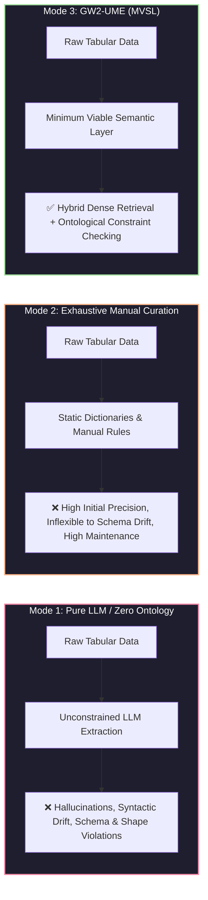

# Minimum Viable Semantic Layer (MVSL) & Semantic Table Interpretation

This document formalizes the central research design of **GW2-UME**: establishing a **Minimum Viable Semantic Layer (MVSL)** to transform heterogeneous semi-structured domain matrices into verified W3C RDF knowledge graphs using **Hybrid Dense Retrieval + Ontological Constraint Checking**.

---

## 1. The Core Research Thesis: The Minimum Viable Semantic Layer (MVSL)

In domain-specific knowledge engineering (such as complex game economies, technical specifications, or industrial operations), tabular extraction pipelines often fall into one of two extremes:

### Definition of MVSL
The **Minimum Viable Semantic Layer (MVSL)** is defined as the *minimal set of formal ontological primitives (classes, properties, domain/range signatures, disjointness axioms) and validation shapes required to constrain statistical model outputs to valid schema constraints and reduce semantic drift without requiring exhaustive manual enumeration of every instance.*

### The Core Tiers of MVSL in GW2-UME
1. **Abstract Structural Primitives (TBox Schema)**:
   - Class Hierarchy: `gw2:Item`, `gw2:CraftingMaterial`, `gw2:PrecursorWeapon`, `gw2:CraftingRecipe`, `gw2:MysticForgeRecipe`, `gw2:Vendor`, `gw2:MapZone`.
   - Datatype Axioms: `xsd:integer` for ingredient quantities and currency costs, `xsd:string` for canonical labels.
2. **Relational Predicates & Morphisms**:
   - Directed Predicates: `gw2:requiresMaterial`, `gw2:hasMysticForgeIngredient`, `gw2:costsCurrency`, `gw2:hasDiscipline`, `gw2:hasPrecursor`.
   - Dynamic Domain/Range Constraints & Disjointness Axioms (e.g. `Disjoint(Weapon, CraftingMaterial)`, `Disjoint(Item, Vendor)`).
3. **Reference Lexicons & Vocabularies**:
   - Standardized universal dimensions: controlled disciplines (`Artificer`, `Weaponsmith`, etc.), rarities, and wallet currencies.
4. **Symbolic Shape Barrier (SHACL)**:
   - Enforces graph-level constraints (e.g., Mystic Forge recipes must have 4 input slots; vendor offers must have map zones; quantities must be positive numbers).

---

## 2. Why Tabular Structure & Ontological Linking Differ from Token-Level NER

Traditional NLP pipelines rely on sequential **Named Entity Recognition (NER)** (e.g., token-level BIO tagging). Tabular extraction differs fundamentally from 1D text extraction:

### Comparative Architectural Breakdown: Sequential NER vs. Semantic Table Interpretation (STI)

| Feature / Dimension | Standard Sequential NER | GW2-UME Semantic Table Engine |
| :--- | :--- | :--- |
| **Input Topology** | 1D sequential token stream | **2D Table Grid & Relational Matrices** |
| **Extraction Model** | Token-level classification | **Joint CTA + CEA + CPA Multi-Task Solver** |
| **Ontological Grounding** | Emits raw string spans | **Canonical URI Linking via Vector Index + Ontology** |
| **Contextual Disambiguation** | Local token window | **Column-wide LCS & Dynamic Domain/Range Compatibility** |
| **Relational Triples** | Separate pipeline (Relation Extraction) | **2D Column-to-Column Directed CPA Predicate Inference** |
| **Formal Validation** | None (accepts ungrounded entities) | **Dynamic OWL 2 Axiom Reasoner & W3C SHACL Shapes** |
| **Self-Correction** | Single feed-forward pass | **Neuro-Symbolic Ping-Pong Diagnostic Feedback Loop** |

### Why 2D Matrices Require Specialized Semantic Table Interpretation

1. **2D Coordinate Semantics**:
   A tabular cell `"250"` in column `Quantity` adjacent to `"Spiritwood Plank"` in column `Material` derives its relational meaning from its **2D coordinate position** and column header. Sequential tokenizers treat this as an isolated `CARDINAL` token without structural binding.

2. **Domain-Specific Polysemy**:
   In Guild Wars 2:
   - *"Raven"* can refer to a Ranger pet, a precursor staff component (*"The Raven Spirit"*), an NPC Havroun, or a map shrine.
   Standard token taggers lack structural awareness of whether the column represents crafting inputs or world locations. GW2-UME uses **Column Type Annotation (CTA)** with Least Common Subsumer (LCS) reasoning to disambiguate the proper ontological class.

3. **Symbolic Axiomatic Verification**:
   Unconstrained LLMs and statistical models can hallucinate invalid game mechanics (e.g., crafting staves with Weaponsmithing, or putting 5 ingredients into a Mystic Forge recipe). Dynamic OWL constraint checking and **SHACL shapes** catch and repair these violations during the ping-pong feedback cycle.

---

## 3. Case Study: Skyscale & Multi-Tier Matrix Evaluation

When evaluated on semi-structured matrices such as the **Skyscale Acquisition Tracker** and multi-tier precursor collection tables:

1. **Structural Inference**:
   - Inferred column class types (`gw2:CollectionStep`, `gw2:Item`, `gw2:CraftingMaterial`) and quantity associations.
   - Correctly linked multi-tier dependencies (Tier 1 $\rightarrow$ Tier 2 $\rightarrow$ Tier 3 $\rightarrow$ Tier 4).
2. **Constraint Enforcement**:
   - The neuro-symbolic feedback loop identified column-level type conflicts and repaired initial noisy proposals into compliant RDF graphs.
3. **Identified Schema Boundaries**:
   - Highlights areas where minimal primitives (such as explicit boolean status indicators) prevent non-item matrix cells from being misclassified as items.

---

## 4. Current System Capabilities

- **Dynamic Ontology Signature Extraction**: Disjoint types (`owl:disjointWith`, `owl:AllDisjointClasses`) and predicate domain/range signatures (`rdfs:domain`, `rdfs:range`) are extracted dynamically from loaded RDF/OWL graphs and `SymbolicAxiomReasoner`.
- **Hybrid Dense Retrieval**: Combines dense text embeddings (FAISS / Numpy vector indices) with lexical and fuzzy string matching for candidate retrieval.
- **Relational Mesh Solver**: Formulates table interpretation as a joint constraint satisfaction problem across CEA, CTA, and CPA.
- **Neuro-Symbolic Ping-Pong Dialogue**: Iterative multi-pass dialogue feeding symbolic constraint diagnostics back to the neural proposal layer until convergence.
- **Standard W3C Serialization**: Exports grounded table interpretations to RDF Turtle and JSON-LD knowledge graphs with SHACL shape validation.

---

## 5. Known Limitations & Validation Scope

- **Evaluation Scope**: Currently validated on curated GW2 domain crafting tables, collection progression matrices, and semi-structured wiki tables. Performance on open-domain web tables has not yet been benchmarked.
- **Schema Prerequisite**: Relies on the existence of a formal ontology (TBox schema) defining classes, properties, and constraints.
- **Table Structure Assumptions**: Best suited for standard tabular grids, matrix layouts, and key-value tables; complex nested tables with irregular merged headers require pre-processing normalizations.

---

## 6. Future Roadmap

- **SemTab Challenge Benchmarking**: Evaluate on standard Semantic Table Interpretation (SemTab) benchmark datasets to assess generalizability across open domains.
- **Automated Multi-Domain Schema Induction**: Extend ontology loading to automatically bootstrap class hierarchies and property signatures from arbitrary OWL/RDFS ontologies and Wikidata schemas.
- **Cross-Domain Knowledge Graph Integration**: Expand beyond gaming domain matrices to technical documentation, biomedical data, and financial reporting tables.
